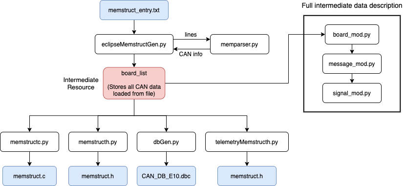

# Memstruct-builder

Le memstruct builder est un outil python utile pour générer les définitions du CAN pour plusieurs projets de Éclipse. 

NOTE: Le script ne fonctionne pas avec python 2. S'assurer d'avoir python version 3 au minimum.

## Utilisation de base

La génération des fichiers de description CAN (.h, .c et .dbc) est faite à partir du fichier `memstruct_entry.txt`. Ce fichier est lu et parsé. Il doit contenir tous les boards, messages et signaux du CAN à générer.

Le format du `memstruct_entry.txt` est le suivant :
```
b:BMS, 0x100, 0, 1
m:M_BMS_HEARTBEAT, 0x00
s:S_BMS_DEVICEID, 		U32,	0,	0,	0,	ID,     0, 100
s:S_BMD_SERIAL, 		U32,	0,	0,	0,	Serial, 0, 100

m:M_BMS_CMU1_ID_TEMP, 0x01
s:S_BMS_CMU1_SERIAL,	U32, 0,	0,	0,	Serial, 0, 100
s:S_BMS_CMU1_PCB_TEMP,	16,  0,	0,	0,	Deg,    0, 100
s:S_BMS_CMU1_CELL_TEMP,	16,	 0,	0,	0,	Deg,    0, 100

b:DRIVE, 0x200, 0, 1
...
```

Pour exécuter la génération des fichiers, il suffit d'exécuter le script python `eclipseMemstructGen.py` :

```
python eclipseMemstructGen.py
```

Les fichiers résultants sont écrits dans le dossier `output/` du dossier root.

## Fichiers output

Les fichiers `memstruct.h` et `memstruct.c` sont utilisés par le code des microcontrôleurs de Éclipse. Il doivent être copiés dans le dossier `Common` du Github.  
Le fichier `telemetryMemstruct.h` est utilisé par le software de télémétrie. Il doit être copié dans le répertoire `/inserter/src/` du projet de télémétrie. Il est nécessaire de recompiler le projet de télémétrie pour que les changement prennent effet.  
Le fichier `CAN_DB_E10.dbc` est utilisé par le Vector CANAnalyzer.

## Description du fichier memstruct_entry.txt

Pour ajouter, enlever ou modifier la description du CAN, il suffit de modifier le fichier `memstruct_entry.txt`. Ce fichier est séparé en définition de boards (b:), de messages (m:) et de signaux (s:)

**IMPORTANT**

 - Pour tous les entrées textes (y compris les unités), s'assurer de n'utiliser que des caractères ASCII (pas de '%', de '°' ou de 'é').
 - Le nom des messages ou signaux ne doit pas dépasser 32 caractères (requis pour la DB du CANAlyzer)
 - La liste des signaux dans les messages commence par celui qui occupe le LSB (offset 0)
 - Si le signal n'a pas d'unité, inscrivez n/a

**Les paramètres de définition pour un board**
```
b:board_name, board_offset, is_extended, is_little_endian
```

Le board offset correspond à la plage des CAN IDs associés à ce board. Par exemple, pour un offset de `0x300`, les messages devraient correspondre à `0x300, 0x301, 0x302, ...`.  
Le flag is_extended représente si les CAN IDs utilisent le CAN extended (1) ou non (0).  
Le flag is_little_endian indique si le board transmet ses messages en little endian (1) ou big endian (0).

**Les paramètres de définition pour un message**
```
m:message_name, message_id
```

**Les paramètres de définition pour un signal**
```
s:signal_name, data_type, init_value, factor, offset, unit, min_value, max_value
```

Le data_type doit être choisi parmis les choix suivants:
 - `Types supportés: 8, 16, 32, U8, U16, U32, F`
 
init_value est la valeur d'initialisation du signal.  
factor est un coefficient multiplicatif qui est associé au signal (pour faire des conversions m/s en km/h par exemple).  
L'unité est un string (ex. 'rpm', 'm/s', 'W') associé au signal.  
Les valeurs minimales et maximales du signal sont indiqués dans min_value et max_value respectivement.  


## Fonctionnement et dataflow du logiciel

Diagramme de fonctionnement du logiciel memstruct-builder :


L'exécution débute à `eclipseMemstructGen.py` où toutes les lignes du `memstruct_entry.txt` sont parsés individuellement pour décoder les paramètres. Le fichier `memparser.py` décodera les paramètres des boards, messages et signaux dépendamment du début de chaque ligne (b:, m: ou s:). Chaque nouveau signal décodé est ajouté au message courant (dernier message lu). De la même manière, chaque message est ajouté au board courant (dernier board lu). Nous obtenons ainsi une description du CAN hiérarchique organisé par les fichiers `board_mod.py`, `message_mod.py` et `signal_mod.py`.

La définition du board contient les messages et la définition du message contient les signaux.

La liste de boards `board_list` généré est ensuite utilisé pour générer les fichiers output. Chaque output est généré par un fichier python associé. Comme décrit précédemment, les fichiers `memstruct.c` et `memstruct.h` sont utilisés par le code firmware des STM32 du véhicule. Le fichier `CAN_DB_E10.dbc` est utilisé par le logiciel CANAnalyzer et le fichier `telemetryMemstruct.h` est utilisé par le logiciel de télémétrie.

## Génération des fichiers output

Chaque niveau de la hiérarchie (signal, message ou board) peut générer un string contenant les informations qui lui sont propres. Par exemple, `signal_mod.py` définit la fonction `print_enum()` pour générer un simple string contenant son nom (qui sera utilisé dans la définition d'un enum). Chaque niveau supérieur de la hiérarchie (message et board) implémente aussi cette fonction `print_enum()` qui génère le string à l'aide de la même fonction au niveau inférieur.

À titre d'exemple, appeler `print_enum()` d'un signal génère une seule entrée pour ce signal. Appeler `print_enum()` d'un message génère un string contenant tous les noms des signaux du message. Appeler `print_enum()` d'un board génère un string contenant tous les noms des signaux du board. 

De cette façon, il devient facile de générer des enums ou arrays de tous les signaux / messages en appelant des fonctions pour chaque board.

## Ajouter une entrée dans les fichiers générés

Pour ajouter une entrée à un fichier -- par exemple un nouvel enum de valeurs -- il faudra ajouter des fonctions dans `board_mod.py` et/ou `message_mod.py` et/ou `signal_mod.py` dépendamment de où ces valeurs sont définis. Si ces valeurs sont défini au niveau des boards, alors seulement une nouvelle fonction pour `board_mod.py` est nécessaire. Si l'information est au niveau des messages, alors il faudra la fonction à `board_mod.py` et `message_mod.py` et ainsi de suite pour une information de signal.

La fonction au plus bas niveau retourne la valeur alors que les niveaux supérieurs combinent ces valeurs individuelles. Dans le fichier python de génération, il suffit d'appeler cette nouvelle fonction pour tous les boards et d'écrire la combinaison des résultats (concat) dans le string de sortie final.

## Tests unitaires


